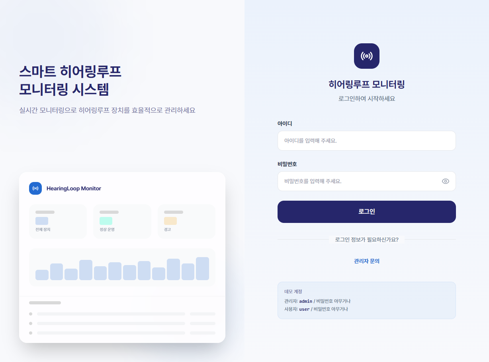
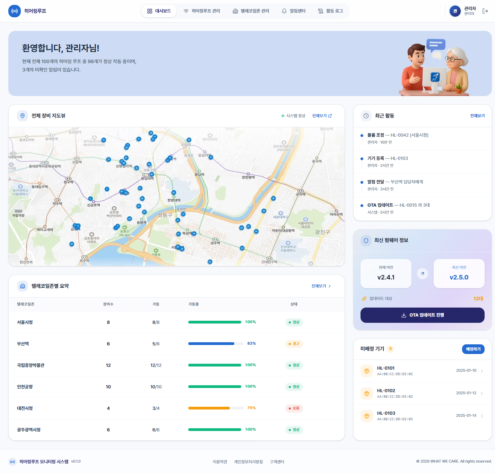
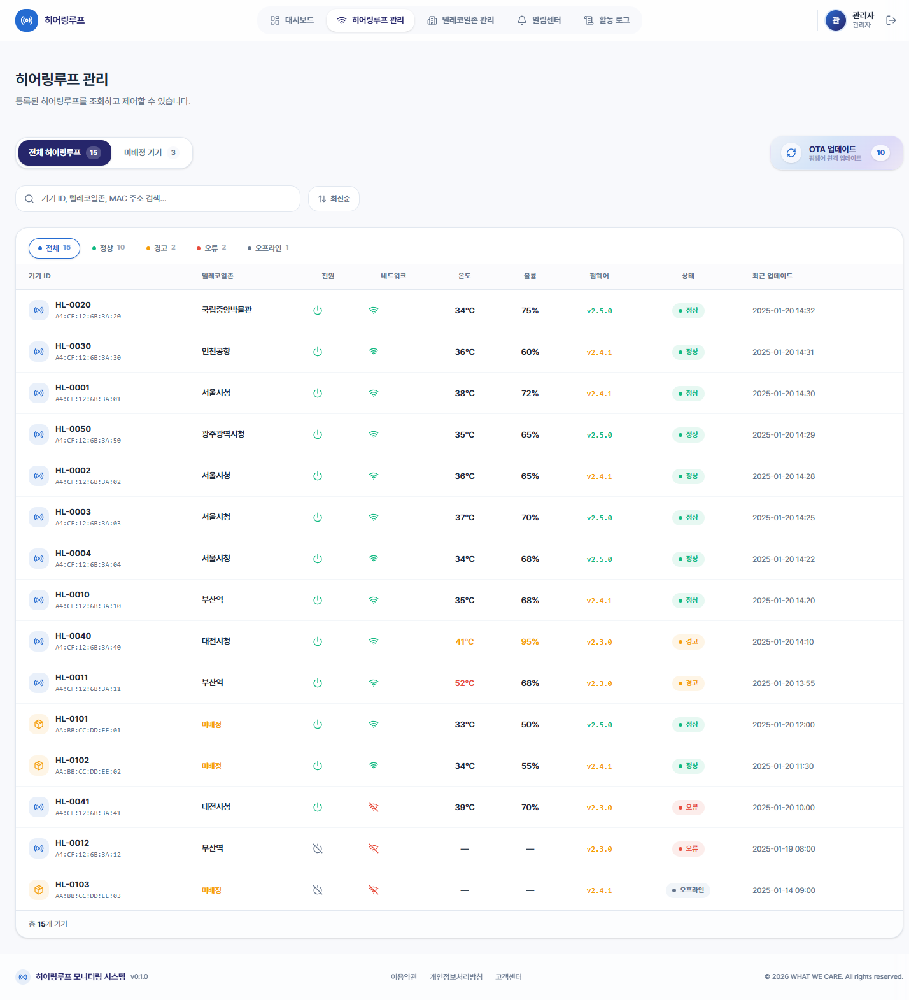
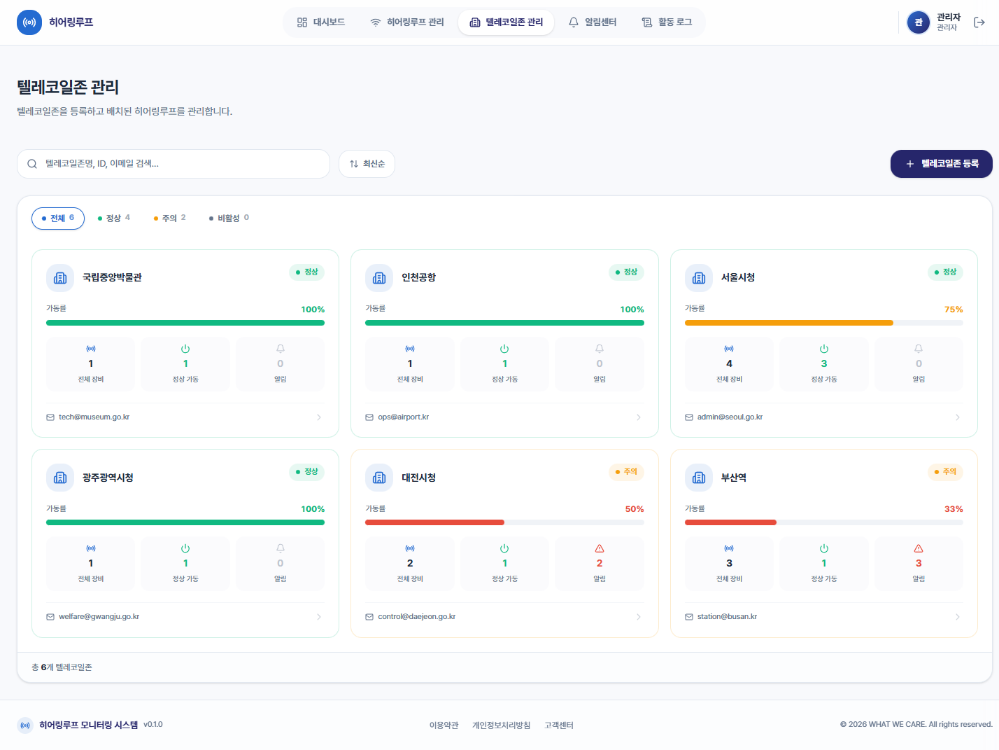
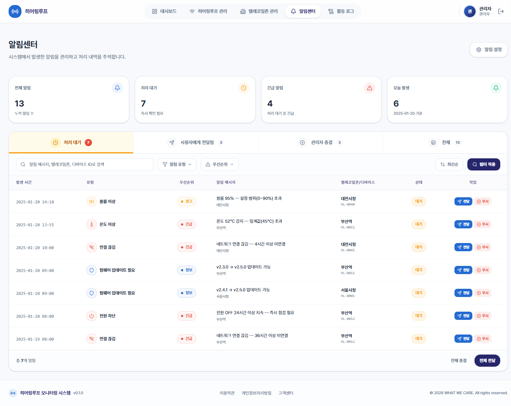
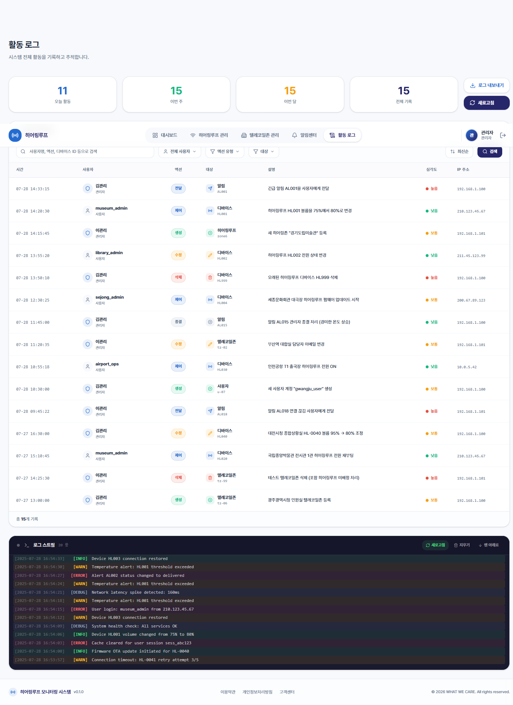
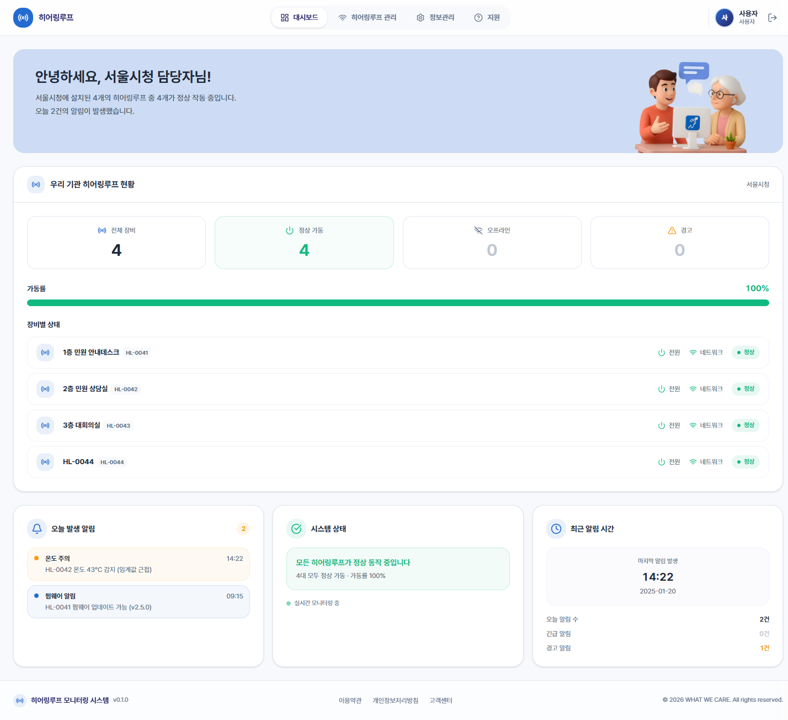
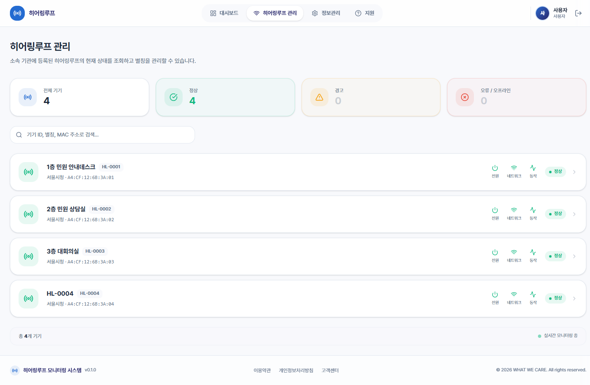
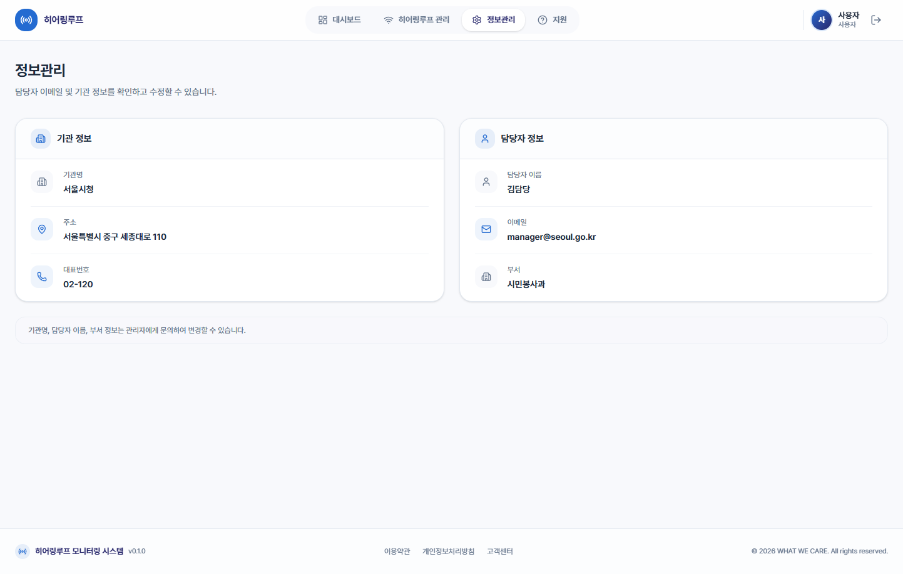
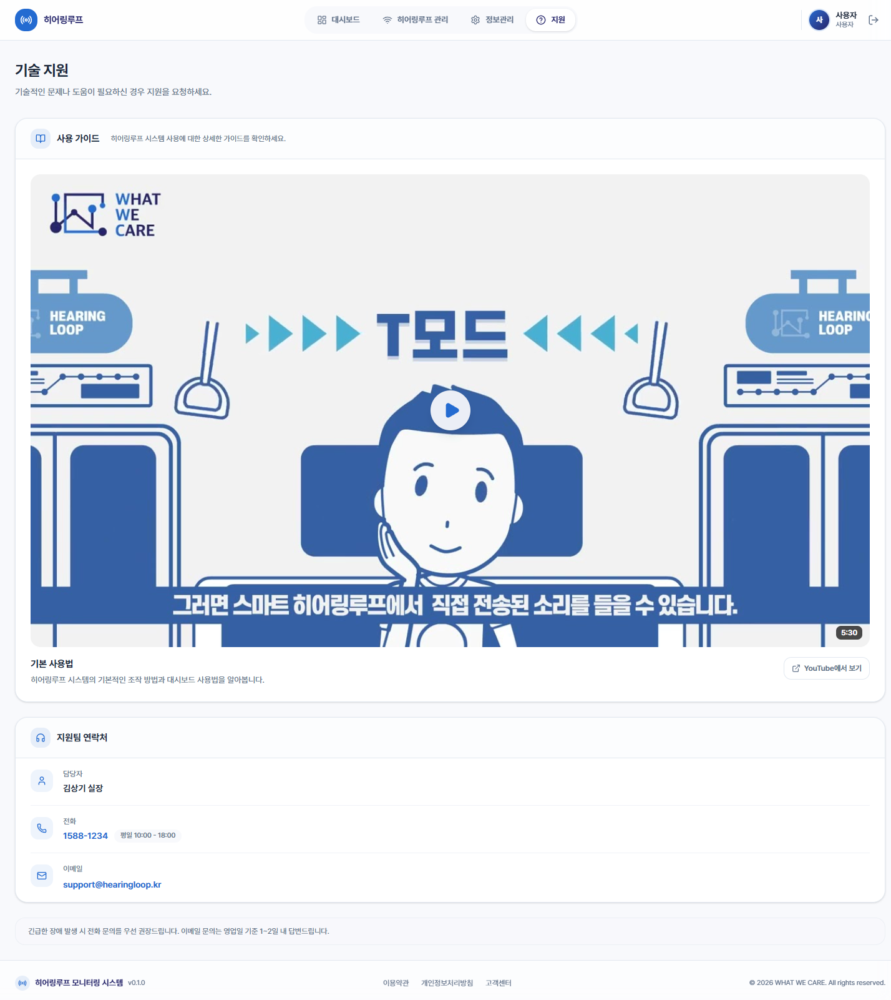

# 히어링루프 모니터링 시스템

공공시설에 설치된 히어링루프 장비의 상태를 실시간으로 모니터링하고 관리하는 웹 기반 플랫폼입니다.

---

## 사용자 역할

시스템은 **관리자(Admin)** 와 **사용자(User)** 두 가지 역할로 구분됩니다.

| 구분 | 역할 | 데이터 범위 | 메뉴 구성 |
|------|------|-------------|-----------|
| **관리자** | 전체 텔레코일존과 히어링루프를 통합 운영 | 전체 기관·기기 | 대시보드, 히어링루프 관리, 텔레코일존 관리, 알림센터, 활동 로그 |
| **사용자** | 소속 기관의 히어링루프를 모니터링 | 소속 기관의 기기만 | 대시보드, 히어링루프 관리, 정보관리, 기술 지원 |

### 데모 계정

| 역할 | 아이디 | 비밀번호 |
|------|--------|----------|
| 관리자 | `admin` | 아무 값 |
| 사용자 | `user` | 아무 값 |

---

## 핵심 개념

### 텔레코일존 = 기관

텔레코일존과 기관은 동일한 단위입니다. 역할에 따라 부르는 명칭이 다릅니다.

- **관리자** 시점 : 여러 기관을 관리하므로 **"텔레코일존"** 이라 부름
- **사용자** 시점 : 본인이 속한 하나의 기관이므로 **"우리 기관"** 이라 부름

### 별칭(Nickname) 시스템

히어링루프 기기에 사용자가 별칭을 부여할 수 있습니다.

- 별칭이 지정된 경우 : **별칭**이 메인 타이틀, `기기 ID`가 서브 태그로 표시
- 별칭이 미지정인 경우 : **기기 ID**가 메인 타이틀로 표시 (동일한 레이아웃)

---

## 라우팅 구조

```
/login                    로그인
/signup                   회원가입

/admin                    관리자 대시보드
/admin/hearing-loops      히어링루프 관리
/admin/telecoil-zones     텔레코일존 관리
/admin/alerts             알림센터
/admin/activity-log       활동 로그

/user                     사용자 대시보드
/user/hearing-loops       히어링루프 관리
/user/settings            정보관리
/user/support             기술 지원
```

---

## 페이지별 기능 명세

### 로그인

> 역할 기반 인증 및 라우팅 분기



- 아이디 / 비밀번호 입력
- 비밀번호 표시/숨김 토글
- 역할에 따라 관리자(`/admin`) 또는 사용자(`/user`) 화면으로 자동 분기
- 로그인 실패 시 에러 메시지 표시

---

### 관리자

#### 대시보드

> 전체 시스템 현황을 한눈에 파악



- 전체 장비 지도뷰
- 텔레코일존별 요약 테이블 (기기 수, 가동률, 상태)
- 미배정 기기 목록 및 배정 기능
- 최근 활동 타임라인
- 최신 펌웨어 정보 및 OTA 업데이트 버튼

#### 히어링루프 관리

> 전체 히어링루프 기기의 상태 조회, 제어, OTA 업데이트



- **탭 구분** : 전체 히어링루프 / 미배정 기기 / OTA 업데이트
- 기기 ID, 텔레코일존, MAC 주소 검색
- 상태 필터 (전체, 정상, 경고, 오류, 오프라인) 및 정렬
- 기기 상세 모달
  - 별칭 편집
  - 전원 토글, 볼륨 조절
  - 온도·펌웨어·네트워크 상태 조회
  - 알림 이력 확인
- OTA 탭에서 개별·전체 펌웨어 업데이트

#### 텔레코일존 관리

> 텔레코일존(기관) 등록, 조회, 상세 관리



- 텔레코일존 카드 그리드 (가동률, 기기 수, 알림 수)
- 상태 필터 (전체, 정상, 주의, 비활성)
- 텔레코일존 등록 모달 (존명, 담당자 이메일, 사용자 계정 생성)
- 텔레코일존 상세 모달
  - 담당자 이메일 수정
  - 사용자 모드 계정 생성 및 관리
  - 배정된 히어링루프 목록 조회
  - 히어링루프 추가 배정
  - 알림 이력 확인

#### 알림센터

> 시스템 알림의 조회, 필터링, 처리(전달·종결)



- KPI 카드 (전체 알림, 처리 대기, 긴급 알림, 오늘 발생)
- **처리 상태 탭** : 처리 대기 / 사용자에게 전달됨 / 관리자 종결 / 전체
- 유형 필터 (온도 이상, 전원 차단, 볼륨 이상, 연결 끊김, 펌웨어 업데이트 필요)
- 우선순위 필터 (긴급, 경고, 정보)
- 알림 상세 모달 (사용자에게 전달 / 무시·종결)
- 일괄 전달 및 일괄 종결
- 알림 설정 (온도·볼륨 임계값, 알림 그룹핑, 자동 에스컬레이션 시간)

#### 활동 로그

> 시스템 전체 활동을 기록하고 추적



- KPI 카드 (오늘 활동, 이번 주, 이번 달, 전체 기록)
- 활동 기록 테이블 (시간, 사용자, 액션, 대상, 설명, 심각도, IP 주소)
- 필터 : 사용자별 / 액션 유형별 (제어, 수정, 삭제, 생성, 전달, 종결) / 대상별 (디바이스, 히어링루프, 텔레코일존, 알림, 사용자)
- 정렬 (최신순 / 오래된순)
- 로그 내보내기
- 실시간 로그 스트림 (터미널 뷰, INFO/WARN/ERROR/DEBUG 레벨 구분)

---

### 사용자

#### 대시보드

> 소속 기관 히어링루프의 전체 현황 파악



- 환영 배너 (기관명, 기기 수, 가동 수, 오늘 알림 수)
- 기관 히어링루프 KPI (전체 / 정상 가동 / 오프라인 / 경고)
- 가동률 프로그레스 바
- 장비별 실시간 상태 목록 (전원, 네트워크, 상태 뱃지)
- 오늘 발생 알림 요약
- 시스템 상태 메시지
- 최근 알림 시간 및 통계

#### 히어링루프 관리

> 소속 기관 히어링루프의 상태 조회 및 별칭 관리



- 상태 KPI 카드 (전체, 정상, 경고, 오류/오프라인)
- 기기 ID, 별칭, MAC 주소 검색
- 기기 카드 목록 (전원·네트워크·동작 상태 표시)
- 기기 상세 모달
  - 별칭 편집 (Enter 저장, Esc 취소)
  - 전원·네트워크·기기 동작 상태 조회
  - 텔레코일존·MAC·등록일·최종 업데이트 정보

#### 정보관리

> 소속 기관 및 담당자 정보 확인·수정



- **기관 정보** : 기관명(읽기 전용), 주소(편집), 대표번호(편집)
- **담당자 정보** : 이름(읽기 전용), 이메일(편집), 부서(읽기 전용)
- 인라인 편집 (hover 시 수정 버튼 표시, Enter/Esc 키보드 지원)
- 저장 완료 토스트 알림

#### 기술 지원

> 사용 가이드 영상 및 기술 지원 연락처



- **사용 가이드** : YouTube 영상 임베드 (썸네일 클릭 시 재생)
- **지원팀 연락처**
  - 담당자 이름
  - 전화번호 (클릭 시 통화 연결) + 영업시간 표시
  - 이메일 (클릭 시 메일 작성)

---

## 기술 스택

| 구분 | 기술 |
|------|------|
| Framework | React 19 |
| Build | Vite 7 |
| Language | TypeScript |
| Styling | Tailwind CSS v4 |
| Icons | Lucide React |
| Deployment | Vercel |
| Analytics | Vercel Analytics |
